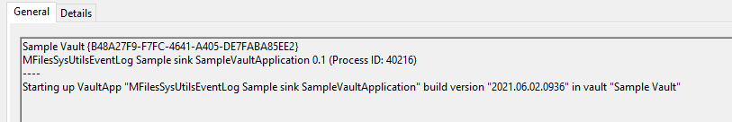
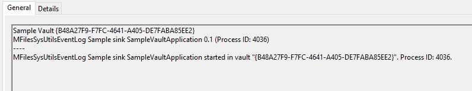
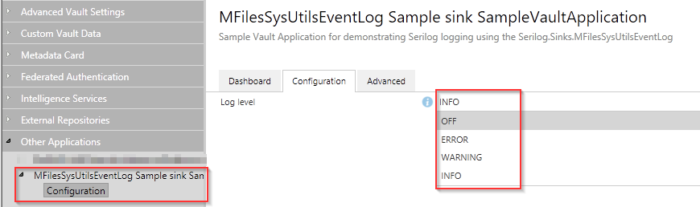
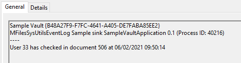

# Serilog.Sinks.MFilesSysUtilsEventLog

[](https://www.nuget.org/packages/Serilog.Sinks.MFilesSysUtilsEventLog)

A Serilog sink wrapper to write to the Windows EventLog using the SysUtils.ReportXToEventLog() in an M-Files Vault Application.

To use the sink, install the **Serilog.Sinks.MFilesSysUtilsEventLog nupkg** into your vault application solution; see below or browse to the [sample vault application code in this repository](samples\SampleVaultApplication\VaultApplication.cs) for pointers how to use it. And here is the nuget.org page for [Serilog.Sinks.MFilesSysUtilsEventLog](https://www.nuget.org/packages/Serilog.Sinks.MFilesSysUtilsEventLog/).

**IMPORTANT:** this sink can only be used in an M-Files Vault Application, as it uses the Vault Application Framework SysUtils.ReportXXXToEventLog() functions.

*Please note that this library is provided "as-is" and with no warranty, explicit or otherwise. You should ensure that the functionality meets your requirements, and thoroughly test them, prior to using in any production scenarios.*

## Use case

An vault application is an addon for an M-Files Vault which has been created using the [M-Files Vault Application Framework](https://developer.m-files.com/Frameworks/Vault-Application-Framework/).
The currently only supported way of logging is using the [SysUtils Event Log reporting helper](https://developer.m-files.com/Frameworks/Vault-Application-Framework/Helpers/SysUtils/#event-log-reporting).

The **Serilog.Sinks.MFilesSysUtilsEventLog** sink makes it possible to use *Serilog structured logging* in an M-Files vault application. For more information about Serilog, see [Serilog.net](https://serilog.net/) and [https://github.com/serilog/serilog](https://github.com/serilog/serilog).


```csharp
Log.Logger = new LoggerConfiguration()
    .WriteTo.MFilesSysUtilsEventLogSink()
    .CreateLogger();

Log.Information("Hello from the Vault Application");
```

## Dependencies

The Serilog.Sinks.MFilesSysUtilsEventLog sink uses [MFiles.VAF version 2.2.0.11](https://www.nuget.org/packages/MFiles.VAF/2.2.0.11) and [Serilog 2.10.0](https://www.nuget.org/packages/Serilog/2.10.0).

## How to add Serilog.Sinks.MFilesSysUtilsEventLog to your vault application

1. Open your vault application solution in Visual Studio and choose `Manage NuGet packages...`. Browse for package `Serilog.Sinks.MFilesSysUtilsEventLog` and add it to your solution.
1. Add `using Serilog;` at the top of your application class.
1. In your VaultApplication.cs class, override InitializeApplication(Vault vault) and add a logging configuration bulder, where you write to the `MFilesSysUtilsEventLogSink` (see below)
1. Add Serilog Log.xxx() statements in your vault application use case code. See [Serilog wiki](https://github.com/serilog/serilog/wiki/Writing-Log-Events) about writing log events.

The sample vault application in this repository uses the sink and even allows for changing the logging level in the vault application configuration in M-Files Admin.

## Example use in a Vault Application

```csharp
using Serilog;

namespace DemoVaultApplication
{
    /// <summary>
    /// The entry point for this Vault Application Framework application.
    /// </summary>
    /// <remarks>Examples and further information available on the developer portal: http://developer.m-files.com/. </remarks>
    public class VaultApplication : ConfigurableVaultApplicationBase<Configuration>
    {

        protected override void InitializeApplication(Vault vault)
        {
            base.InitializeApplication(vault);

            // Configure logging
            Log.Logger = new LoggerConfiguration()
                .WriteTo.MFilesSysUtilsEventLogSink()
                .CreateLogger();
        }


        [EventHandler(MFEventHandlerType.MFEventHandlerBeforeCheckInChangesFinalize,
                        ObjectType = (int)MFBuiltInObjectType.MFBuiltInObjectTypeDocument)]
        public void BeforeCheckInChangesFinalizeUpdateLogDemo(EventHandlerEnvironment env)
        {
            Log.Information("User {UserID} has checked in document {DisplayID} at {TimeStamp}",
                                env.CurrentUserID, 
                                env.DisplayID, 
                                DateTime.Now);
        }
    }
}
```

When a user checks in a document in the vault where the vault application is installed. the Log.Information statement will produce a Windows Event log entry similarly to below:

```text
DemoVault {D449E438-89EE-42BB-9769-B862E9B1B140}
DemoVaultApp 0.1 (Process ID: 35700)
----
User 1 has checked in document 1 at 05/29/2021 23:04:00
```

## Cloud vault

Your vault application can be installed on either a local M-Files server or on a cloud vault. With the local server, you'll have access to the Windows Event log and the logging from your application.

A cloud vault is operated by the M-Files CloudOps team and you do not have direct access to the Windows Event log on the (Azure) server where the vault runs. If you want your vault application's logging, you'll have to request it from M-Files support. It's hardly ideal, but at least you're using structured logging with Serilog in your application now!
I have another logging solution coming up that will help in logging scenarios in cloud vault application.

## Sample vault application

The sample vault application writes some log messages upon startup and with firing of the MFEventHandlerBeforeCheckInChangesFinalize event for an Document ObjectType.

It has not one but **two** MFilesSysUtilsEventLogSinks configured, one with the default output message template and the other with the RenderedCompactJsonFormatter which outputs the log event in *JSON format* to the Windows event log as well and shows *all* log event properties.

Because of the two sinks, the Windows Event Log will contain the **same** log event twice, but formatted differently. It demonstrates that a log pipeline can be build with multiple sinks, even the same sink with different parameters.

```text
// The FIRST will only show the log event message; the "MFEventType" property is not shown, because it is not part of the default message template.
//   "User 33 has checked in document 506 at 06/01/2021 21:15:10"
```

```text
// The SECOND will show the JSON rendering of the log event, INCLUDING the "MFEventType" property that was added from the LogContext.
//   {"@t":"2021-06-01T21:15:10.9941533Z","@m":"User 33 has checked in document 506 at 06/01/2021 21:15:10","@i":"5cf5a3bc","UserID":33,"DisplayID":506,,"TimeStamp":"2021-06-01T21:15:10.9931527+02:00"","MFEventType":"MFEventHandlerBeforeCheckInChangesFinalize"}
```

These screen shots are from the Windows Event log on a local M-Files server and from the M-Files Admin.

**Starting up: Logging something in vault initialization**

```csharp
// And log some information about this VaultApp
Log.Information("Starting up VaultApp {VaultAppName} build version {VaultAppBuildVersion} in vault {VaultName}", 
                    thisVaultApp.Name, 
                    _buildFileVersion, 
                    vault.Name);
```



**Starting up: M-Files server has loaded sample vault application**



**Changing log level in M-Files Admin**



**Logging from event handler**

```csharp
Log.Information("User {UserID} has checked in document {DisplayID} at {TimeStamp}",
                    env.CurrentUserID, 
                    env.DisplayID, 
                    DateTime.Now);
```



